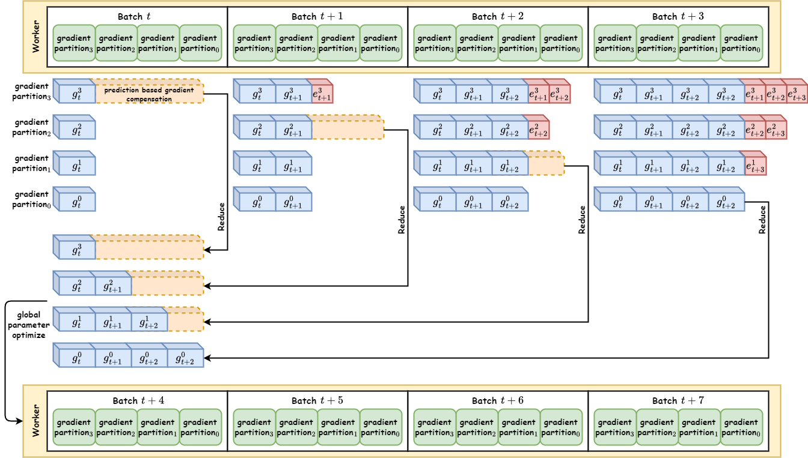

# polar-sgd

To reduce communication overhead in cross dc distributed training, we implement a method called Polar SGD.

Polar SGD is designed to improve the efficiency of distributed training by overlapping communication and computation. It achieves this by predicting gradients for future time steps and using these predictions to update the model parameters.

## prepare environment

just run following command to install required packages

```bash
conda create -n polar-sgd python=3.12
cd polar-sgd
pip install -e .
```

then you need to login into your huggingface account to download the model weights and tokenizer and dataset.

```bash
huggingface-cli login
```

## Run Polar SGD

To run Polar SGD, you can use the following command on each node, replacing `{RANK}` with the node's rank (0 to N-1):

Each node is a standard dp, pp is set intra node.

```bash
sh scripts/xdp_ypp/{RANK}_train_llama7b_polar_dp_pp.sh  # Replace {RANK} with 0 to N-1
```

To enable different modes of Polar SGD, you need to change the parameters in the script files. Detailed instructions is written in `tests/train_llama7b_polar_dp_pp.py`.
you need to specify the `--use_polar_sgd` flag in the training script to enable Polar SGD.

To run standard ddp or manually all-reduce based dp training with pp hybrid, you need to run `sh scripts/xdp_ypp/baseline/ddp/{RANK}_train_llama7b_ddp_dp_pp.sh`.

Humorous experiments scripts have been done to compare Polar SGD with baseline ddp and local sgd. Please refer to directory `scripts` for more details.

## Methodology 

now the repository not only implements the basic method published in our paper, but also enable different gradient prediction methods, such as: 
- Naive: use the last gradient as the prediction for all the future gradients.
- Linear: use linear regression to predict the future gradients based on previous gradients.
- EMA: use exponential moving average to predict the future gradients.
- Delayed: use the gradient from previous time steps as the prediction for future gradients with a delay.

The experiments in our paper are based on the naive prediction method. You can specify the prediction method by changing the `--gradient_prediction_method` argument in the training script. If you have further insights or ideas about gradient prediction, you are welcome to implement your own method and contribute to this repository.

<!-- SGD formula on node $i$: 

$$
\theta_{t + 1}^i = \theta_t^i - \eta \cdot g_t^i
$$

then: 

$$
\theta_{t + T}^i = \theta_t^i - \eta \cdot \sum_{n = 0}^{T - 1} g_{t + n}^i
$$

$\theta_t^i$ is the model parameters on node $i$ at batch $t$, $g_t^i$ is the gradient of the model parameters on node $i$ at batch $t$. $\eta$ is the learning rate.

For Local SGD,

$$
\begin{align}
    \theta_{t + T} & = \frac{1}{K} \sum_{i=0}^{K-1} \theta_{t + T}^i \\
    \theta_{t + T} & = \frac{1}{K} \sum_{i=0}^{K-1} \left(\theta_t^i - \eta \cdot \sum_{n = 0}^{T - 1} g_{t + n}^i \right) \\
    \theta_{t + T} & = \frac{1}{K} \sum_{i=0}^{K-1} \theta_t^i - \frac{1}{K} \sum_{i=0}^{K-1} \eta \cdot \sum_{n = 0}^{T - 1} g_{t + n}^i \\
    \theta_{t + T} & = \theta_t - \frac{\eta}{K}\sum_{i=0}^{K-1}\sum_{n = 0}^{T - 1} g_{t + n}^i \\
\end{align}
$$

As the above formula (1) shows, the global model parameters are calculated by averaging the local model parameters of time step $t + T$, which leads to strictly synchrounous updates. Strictly synchronous updates are not always desirable, cause a strictly synchronous update means communication cannot be overlapped with computation. When communication overhead is high, a not overlapped communication often leads to worse performance. 

We proposed a new method to update the global model parameters, which is called Polar SGD. 

In Polar SGD, we update the global model parameters by transmit gradient. The Architecture of Polar SGD is shown in the following figure. 




We proposed a gradient prediction method to increase the communication and computation overlap. 

Assuming the local steps is $T=C \cdot K$, which $C$ is an integer, $K$ is the size of the nodes. 

For the case of $C=1$:

$$
\begin{align}
    \theta_{t + K} & = \frac{1}{K} \sum_{i=0}^{K-1} \theta_{t + K}^i \\
    \theta_{t + K} & = \frac{1}{K} \sum_{i=0}^{K-1} \left(\theta_t^i - \eta \cdot \sum_{n = 0}^{K - 1} g_{t + n}^i \right) \\
    \theta_{t + K} & = \frac{1}{K} \sum_{i=0}^{K-1} \theta_t^i - \frac{1}{K} \sum_{i=0}^{K-1} \eta \cdot \sum_{n = 0}^{K - 1} g_{t + n}^i \\
    \theta_{t + K} & = \theta_t - \frac{\eta}{K}\sum_{i=0}^{K-1}\sum_{n = 0}^{K - 1} g_{t + n}^i \\
\end{align}
$$

For layer-wise partition of the model parameters, 
$\mathrm{\theta}_{t} = \left[\theta_{t, 0}, ..., \theta_{t, K-1}\right]$, $g_{t} = \left[g_{t, 0}, ..., g_{t, K-1}\right]$

$$
\begin{align}
    \theta_{t + K, m} & = \frac{1}{K} \sum_{i=0}^{K-1} \theta_{t + K, m}^i \\
    \theta_{t + K, m} & = \frac{1}{K} \sum_{i=0}^{K-1} \left(\theta_{t, m}^i - \eta \cdot \sum_{n = 0}^{K - 1} g_{t + n, m}^i \right) \\
    \theta_{t + K, m} & = \frac{1}{K} \sum_{i=0}^{K-1} \theta_{t, m}^i - \frac{1}{K} \sum_{i=0}^{K-1} \eta \cdot \sum_{n = 0}^{K - 1} g_{t + n, m}^i \\
    \theta_{t + K, m} & = \theta_{t, m} - \frac{\eta}{K}\sum_{i=0}^{K-1}\sum_{n = 0}^{K - 1} g_{t + n, m}^i \\
\end{align}
$$

lets assume the prediction function is $P(g, \tau)$, which $g$ is the gradient and $\tau$ is the gradient of next $\tau$ time steps.

$$
\begin{align}
    \theta_{t + K, m} & = \frac{1}{K} \sum_{i=0}^{K-1} \theta_{t + K, m}^i \\
    \theta_{t + K, m} & = \theta_{t, m} - \frac{\eta}{K}\sum_{i=0}^{K-1}P(\sum_{n=0}^m g_{t + n, m}^i, K, m) \\
\end{align}
$$

For the formula above, we can get parameter partition $m$'s update for $t+K$ step just calculate to the $t+m$ step instead of $t+K$ step. 

Further, we can get the prediction partition $m$'s parameter $\theta_{t+K, m}$ at $t+m$ step. So if we started from time step $t$, in the next K steps, we can get all the prediction partition from partition 0 to partition K-1 in each step.  -->