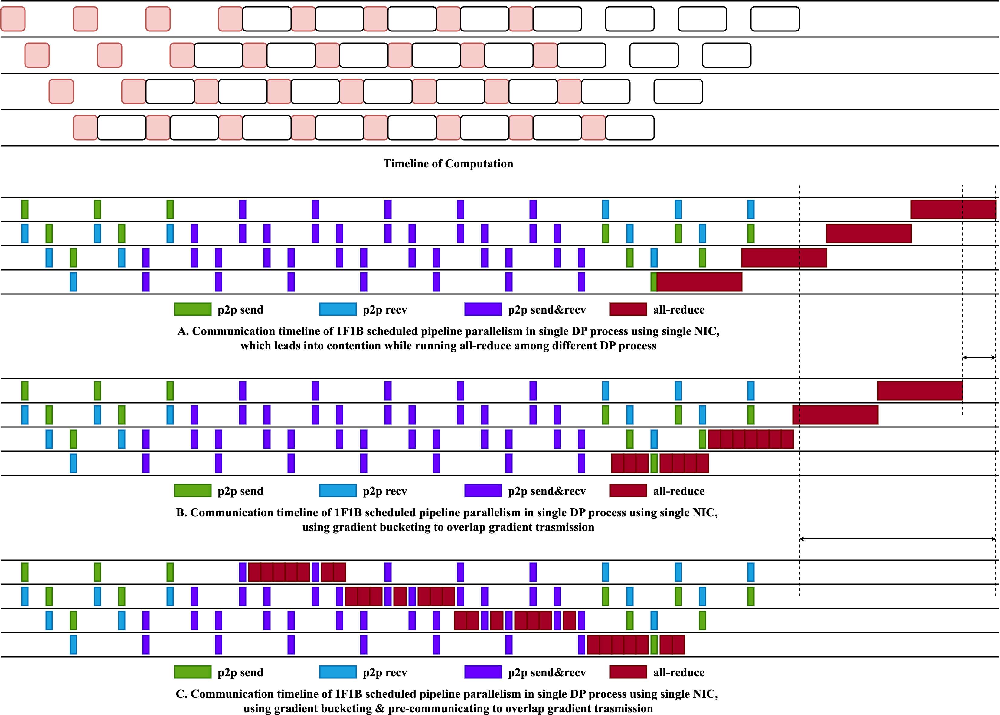

# polar-sgd

## Local SGD part
考虑在DP并行中的节点$i$，有如下使用SGD进行梯度下降更新参数的公式: 

$$
\theta_{t + 1}^i = \theta_t^i - \eta \cdot g_t^i
$$

于是对于$T$步后的参数，有： 

$$
\theta_{t + T}^i = \theta_t^i - \eta \cdot \sum_{n = 0}^{T - 1} g_{t + n}^i
$$

<!-- $\theta_t^i$ is the model parameters on node $i$ at batch $t$, $g_t^i$ is the gradient of the model parameters on node $i$ at batch $t$. $\eta$ is the learning rate. -->
$\theta_t^i$ 是节点 $i$ 在第 $t$ 个 batch 的模型参数，$g_t^i$ 是节点 $i$ 在第 $t$ 个 batch 反向传播产生的梯度数据。 $\eta$ 是学习率

For Local SGD,

$$
\begin{align}
    \theta_{t + T} & = \frac{1}{K} \sum_{i=0}^{K-1} \theta_{t + T}^i \\
    \theta_{t + T} & = \frac{1}{K} \sum_{i=0}^{K-1} \left(\theta_t^i - \eta \cdot \sum_{n = 0}^{T - 1} g_{t + n}^i \right) \\
    \theta_{t + T} & = \frac{1}{K} \sum_{i=0}^{K-1} \theta_t^i - \frac{1}{K} \sum_{i=0}^{K-1} \eta \cdot \sum_{n = 0}^{T - 1} g_{t + n}^i \\
    \theta_{t + T} & = \theta_t - \frac{\eta}{K}\sum_{i=0}^{K-1}\sum_{n = 0}^{T - 1} g_{t + n}^i \\
\end{align}
$$

如公式(1)所示，全局模型参数通过求取时间步$t + T$处局部模型参数的平均值计算得出，这导致了严格同步的更新机制。严格同步更新并非总是理想选择，因为它意味着通信操作无法与计算操作重叠执行。当通信开销较高时，非重叠通信往往会导致性能下降。

我们提出了一种更新全局模型参数的新方法，称为（Polar SGD）。我们通过传输梯度来更新全局模型参数。其架构如图所示。

我们提出了一种梯度预测方法以增加通信与计算的重叠度。

假设局部步数为 $T=C \cdot K$，其中 $C$ 为整数，$K$ 为节点数量。

当 $C=1$ 时：

$$
\begin{align}
    \theta_{t + K} & = \frac{1}{K} \sum_{i=0}^{K-1} \theta_{t + K}^i \\
    \theta_{t + K} & = \frac{1}{K} \sum_{i=0}^{K-1} \left(\theta_t^i - \eta \cdot \sum_{n = 0}^{K - 1} g_{t + n}^i \right) \\
    \theta_{t + K} & = \frac{1}{K} \sum_{i=0}^{K-1} \theta_t^i - \frac{1}{K} \sum_{i=0}^{K-1} \eta \cdot \sum_{n = 0}^{K - 1} g_{t + n}^i \\
    \theta_{t + K} & = \theta_t - \frac{\eta}{K}\sum_{i=0}^{K-1}\sum_{n = 0}^{K - 1} g_{t + n}^i \\
\end{align}
$$

对于模型参数的分层划分，
$\mathrm{\theta}_{t} = \left[\theta_{t, 0}, ..., \theta_{t, K-1}\right]$, $g_{t} = \left[g_{t, 0}, ..., g_{t, K-1}\right]$

$$
\begin{align}
    \theta_{t + K, m} & = \frac{1}{K} \sum_{i=0}^{K-1} \theta_{t + K, m}^i \\
    \theta_{t + K, m} & = \frac{1}{K} \sum_{i=0}^{K-1} \left(\theta_{t, m}^i - \eta \cdot \sum_{n = 0}^{K - 1} g_{t + n, m}^i \right) \\
    \theta_{t + K, m} & = \frac{1}{K} \sum_{i=0}^{K-1} \theta_{t, m}^i - \frac{1}{K} \sum_{i=0}^{K-1} \eta \cdot \sum_{n = 0}^{K - 1} g_{t + n, m}^i \\
    \theta_{t + K, m} & = \theta_{t, m} - \frac{\eta}{K}\sum_{i=0}^{K-1}\sum_{n = 0}^{K - 1} g_{t + n, m}^i \\
\end{align}
$$

假设预测函数为 $P(g, \tau)$，其中 $g$ 表示当前梯度，$\tau$ 表示未来 $\tau$ 个时间步的梯度。

$$
\begin{align}
    \theta_{t + K, m} & = \frac{1}{K} \sum_{i=0}^{K-1} \theta_{t + K, m}^i \\
    \theta_{t + K, m} & = \theta_{t, m} - \frac{\eta}{K}\sum_{i=0}^{K-1}P(\sum_{n=0}^m g_{t + n, m}^i, K, m) \\
\end{align}
$$

对于上述公式，我们只需计算至$t+m$步而非$t+K$步，即可获得参数分区$m$在$t+K$步时的更新值。

此外，我们可在$t+m$步获取预测分区$m$的参数$\theta_{t+K, m}$。因此若从时间步$t$开始，在后续K步中，每一步都能获取从分区0到分区K-1的所有预测分区。

## DP&PP part

有这样一个场景，数据在广域分散分布，为了避免进行数据的统一收集并预处理，选用数据并行使得数据可以在分散的地域进行预处理工作。从而构成了以广域分布的节点或集群为单位的广域数据并行。以获取更高的吞吐率。同时，对于大型模型，在集群内部采用流水线并行的方式进行训练。

从而引发的一些挑战是，跨域all-reduce的时间不能被pp的分块掩盖，导致跨域all-reduce的出口带宽争用：如图stage4的all-reduce还没执行完，stage3的all-reduce就需要去发送了，导致stage3实际执行all-reduce的时间被延迟了。同理，这个影响从stage4反向影响到stage1，从而直接影响到下一轮step的执行。

### 实现

尝试实现一个通信线程池，利用chunked all-reduce的思想，将单个较长的all-reduce划分多块进行发送，但是和p2p的执行放在一起。进行pp优先调度方案。默认无pp通信时，执行下一块的chunked all-reduce。

由于Pytorch + nccl默认不提供任何的通信优先级或抢占式调度机制。因此，要实现这一目标，需要

使用信号量/互斥锁和事件标志，确保 p2p 发起时，all-reduce要么尚未开始，要么等待 p2p 完成

如果 all-reduce 由于节点间没有同步从而 hang 住了，此时需要打开GPU多流通信，多流通信机制使得 p2p 操作在此时可以和 all-reduce 并发执行，不会由于allreduce hang住而阻塞

对于每个pp stage，建立其梯度空间和补偿空间。由于我们只传部分microbatch产生的梯度数据，所以对于其他microbatch产生的数据，需要在补偿空间中进行累加，直到需要进行下一次all-reduce时，将这个补偿值累计到这个all-reduce中来更新。