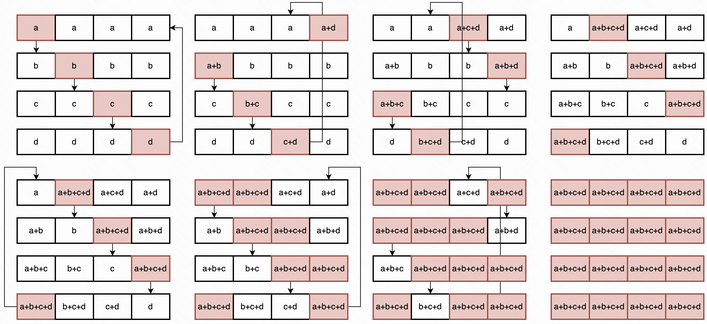
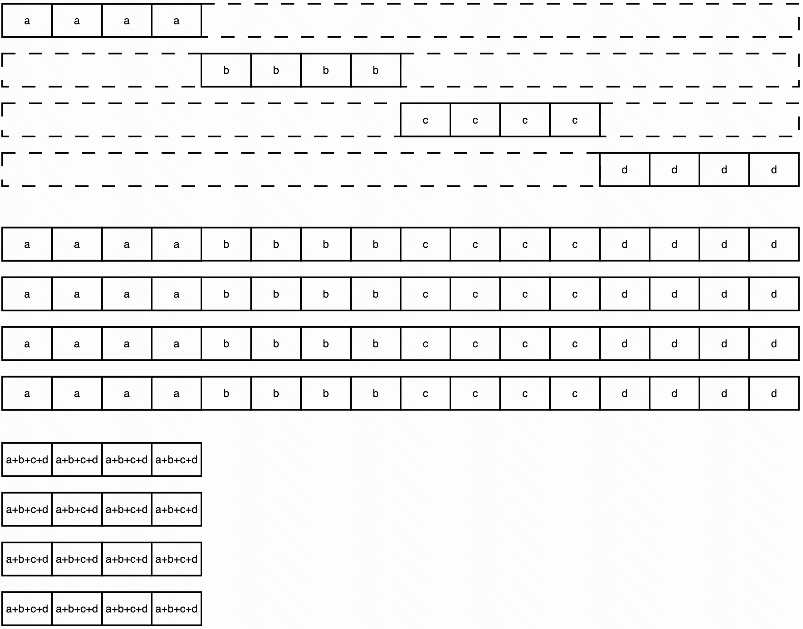
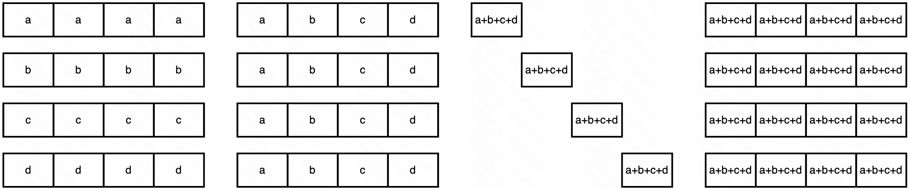

Assumptions:

* $N$ 为参与 `all-reduce` 的节点数量
* $V$ 为待进行 `all-reduce` 的数据量（假设采用FP32存储）
* $B$ 为节点间带宽
* $\beta$ 为 $1/B$，即每比特传输耗时
* $\alpha$ 为传输延迟

### 经典通信算法与其通信开销分析

首先，我们对通信开销建模：  
经典的 $\alpha$, $\beta$ 模型如下，比较好理解，$\alpha$ 是通信延迟（一般取决于机器网络协议栈，比如最经典的优化方式如RDMA，DPDK等），$\beta$ 是传输带宽的反比，也就是实际在网络传输中的时间开销。
$$
\tau = \alpha + \beta V
$$

#### all-reduce

用最通用的ring算法来举例，**all-reduce**可以分解为两个操作：**reduce-scattor**，**all-gather**，分别对应上图中的第一行和第二行。

##### reduce-scatter
该操作从直观上执行了，将所有数据all-reduce后，将结果分为4份，分别发送给4个节点。从实现上是不需要直接all-reduce操作的，它首先将原始数据分为了4份，每个节点同时收发。如图所示，十分直观，如需了解@liyuntong

$$
\tau = \alpha + \beta V / N
$$

由于有$N$个节点，因此需要连续通信$N-1$步。从而得到：

$$
\tau_{ReduceScattor} = (N - 1)\alpha + (N-1)\beta V / N \approx N\alpha + \beta V
$$

##### all-gather
该操作执行了，将每个节点上的数据全部收集到一起。如图，每个节点的数据都发送给其他节点，每个节点接到其他节点的数据便将其存储起来。数据量由本地的数据变为所有节点的数据。实际上的操作如右图所示，十分直观，如需了解@liyuntong

通信开销分析：  
同上：
$$
\tau_{AllGather} = (N - 1)\alpha + (N-1)\beta V / N \approx N\alpha + \beta V
$$

#### all-to-all
all-to-all会稍微复杂一点，
算法描述：来自MPI和NCCL，以及教材*Introduction to Parallel Computing*  
对于 k=0 to N-2  
1. 发送：每个节点r将节点`r-k-1 mod N`所需要的块发送给他的下一个邻居（`r+1 mod N`）
2. 接受：接受节点编号（`r-1 mod N`）发给我的块
3. 检查：这个块是不是本节点需要的块，如果不是，继续转发给下一个，是就保留。

从上面也可以看到，all-to-all的实现过程类似reduce-scatter和all-gather，但是需要一个块大小（$V/N$）的缓冲区。
同理，其开销为：
$$
\tau_{All2All} = (N - 1)\alpha + (N-1)\beta V / N \approx N\alpha + \beta V
$$

### 理想的量化分析

1. “量化多少，对应的通信就应该减少多少”：  
2. “量化了就一次性解决问题，不要做多余的量化操作影响精度”

### **在采用 1-bit 量化下：**

先来看一下不压缩的 `all-reduce` 方式的耗时：
$$
\tau_{AllReduce} = 2(N - 1)\alpha + 2(N-1)\beta V / N \approx 2N\alpha + 2\beta V
$$

那么，如果我们采用 1-bit 量化，那么我们最理想的通信开销是：
$$
\tau_{1bitAllReduce(ideal)} = 2(N - 1)\alpha + 2\frac{N-1}{32N}\beta V \approx 2N\alpha + 2\frac{\beta V}{32}
$$

但是，实际上由于计算架构的存在，不管是1-bit，只要是bit位数小于1B的量化方案，都会遇到all-reduce原始方式不兼容的问题：你无法直接计算低比特量的规约结果！你能做的只能是把要规约的bit拿到一起，反量化成可计算的值，然后reduce。

接下来我们看一下最常用的两个方式：

#### **如果采用 `all-gather` + `inner-reduce` 的方式：**

这个方法十分暴力，直接拿到所有节点的值然后在本地反量化规约即可实现，但是由于其all-gather的并不是一小块数据，而是所有数据，其通信开销一定和节点数$N$成正比：

$$
TimeCost = (N - 1)\alpha + \frac{N - 1}{32}\beta V \approx N\alpha + \frac{N}{32}\beta V
$$

可以发现，即使采用了 1-bit 量化，如果不计传输延迟，在 N > 64 的情况下，`all-gather` 的方式耗时甚至大于采用全量的 `all-reduce` 方式。N > 16 的情况下，`all-gather` 的方式耗时大于采用INT8量化的 `all-reduce` 方式。

#### **如果采用 `all-to-all` + `all-gather` 的方式**

* `all-to-all` 部分：
$$
\tau_1 = (N - 1)\alpha + \frac{N - 1}{32N}\beta V \approx N\alpha + \frac{\beta V}{32}
$$
* `all-gather` 部分：
$$
\tau_2 = \tau_1
$$

其中，`all-to-all` 部分和 `all-gather` 部分之间需要进行一次节点内的对 `all-to-all` 获得的数据的reduce操作，该reduce操作涉及到反量化和浮点计算，因此对计算后的值还需要进行一次量化，来使得 `all-gather` 仍为规约 1-bit 值。

### 如果我们针对第二种方法做优化，该如何做？

为了避免二次损失精度，我们可以考虑不在 `all-to-all` 后面进行低比特量化操作，从而保留原值。这样 `all-gather` 部分的通信时长就变为：

$$
\tau_2 = (N - 1)\alpha + \frac{N - 1}{N}\beta V \approx N\alpha + \beta V
$$

此时还可以进一步进行优化，我们知道，在做 1-bit 量化后，可以用 0 代表 -1， 1 代表 1。那么即使是最极端的情况下，`all-to-all` 操作后的节点内 reduce(op=sum) 的结果的取值区间应当在 $[-N, N]$之间。这个取值完全可以使用$\lceil log_2^N \rceil + 1$个比特位来表示，那么我们的通信时延可以进一步缩短

$$
\tau_2 = (N - 1)\alpha + \frac{\lceil log_2^N \rceil + 1}{32}\frac{N - 1}{N}\beta V \approx N\alpha + \frac{\lceil log_2^N \rceil + 1}{32}\beta V
$$

总体通信时延是：
$$
TimeCost = \tau_1 + \tau_2 \approx 2N\alpha + \frac{\lceil log_2^N \rceil + 2}{32}\beta V
$$

这样便规避了一次二次量化，降低了意料之外的精度损失，同时通信时延虽然有所提升，但如果机器数小于$2^{14}$，那么该方法通信时延仍旧小于INT8量化，如果机器数小于$2^6$，那么该方法的通信时延是INT8量化的时延的一半。依旧能够保证量化压缩的高效性。

此外，无需特别保证all-to-all reduce后的原值保证，通常来说，达到>N/2和<-N/2属于较小概率事件，因此可以考虑在机器数不是很大的情况下继续减小位宽。